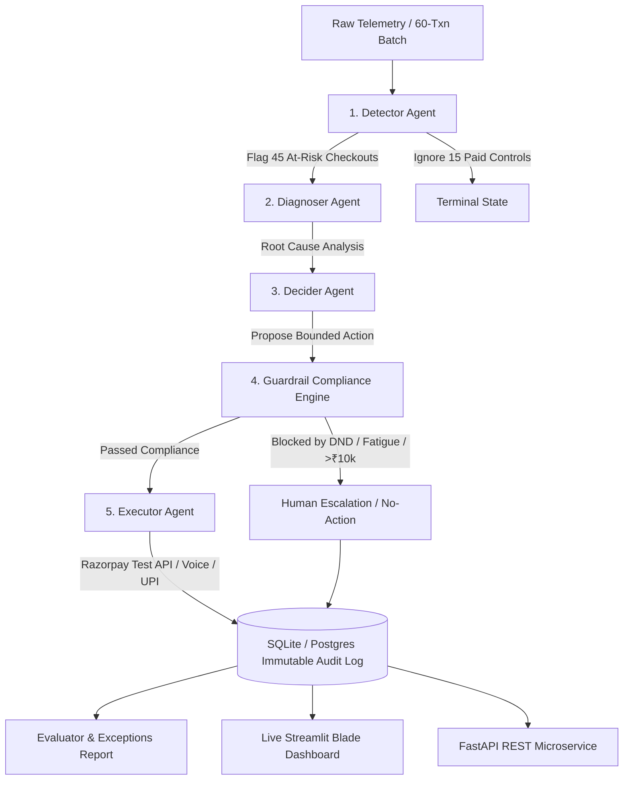

# RazorRevive ⚡ Autonomous AI Revenue Recovery Agent
### Razorpay Track 03: Autonomous Checkout Drop-Off Recovery Agent: From Telemetry to Captured Revenue

[](https://www.python.org/downloads/)
[](https://fastapi.tiangolo.com)
[](https://streamlit.io)
[](https://ai.google.dev/)
[-success.svg)](https://pytest.org)
[](https://blade.razorpay.com)

> **"Don't just diagnose why transactions drop off. Measure recovered revenue, enforce compliant dunning guardrails, negotiate in natural Indian Hinglish, and record every rupee in an immutable audit ledger."**

---

## 📑 Table of Contents
1. [Executive Summary & Problem Statement](#-1-executive-summary--problem-statement)
2. [Key Highlights & Innovation](#-2-key-highlights--innovation)
3. [Multi-Agent Swarm Architecture](#-3-multi-agent-swarm-architecture)
4. [The 5 Core Application Tracks & Interactive Modules](#-4-the-5-core-application-tracks--interactive-modules)
5. [Benchmark Metrics & Evaluation Report](#-5-benchmark-metrics--evaluation-report)
6. [Live 2-Minute Jury Demo Script](#-6-live-2-minute-jury-demo-script)
7. [Local Quickstart & Setup Guide](#-7-local-quickstart--setup-guide)
8. [Deploying Live to Render](#-8-deploying-live-to-render)
9. [REST API Documentation & Endpoints](#-9-rest-api-documentation--endpoints)
10. [Test Suite Verification (46/46 Passing)](#-10-test-suite-verification-4646-passing)

---

## 🚀 1. Executive Summary & Problem Statement

Revenue in Indian digital commerce leaks silently at granular friction points: **bank-side OTP delays, UPI gateway switch timeouts, transient network drop-offs, and B2B invoice aging**. 

Traditional recovery mechanisms fail because they:
* Blast aggressive, generic "You forgot items in your cart" emails that annoy customers.
* Train customers to intentionally abandon checkout to fish for discounts.
* Ignore strict Indian compliance norms (harassing customers late at night or during bank downtime).
* Lack conversational empathy to answer technical payment questions in real-time Indian languages.

**RazorRevive** is an enterprise-grade, closed-loop autonomous AI agent suite built directly on the **Razorpay Blade Design System**. It diagnoses checkout failure telemetry, executes bounded multi-channel recovery workflows, provides real-time **Hinglish AI Voice & Chat Telephony**, manages an automated **Promise-to-Pay (PTP) Ledger**, orchestrates **B2B DSO Invoicing**, and optimizes **Off-Peak UPI Mandates** with 100% audit compliance.

---

## 🌟 2. Key Highlights & Innovation

* 🎙️ **Real-Time Hinglish Voice & Chat AI Concierge**: Powered by **Google Gemini 3.6 Flash** with multi-step reasoning, real-time speech recognition (STT), voice synthesis (TTS), 2026 calendar grounding, and live English translation drawers.
* 📅 **Promise-to-Pay (PTP) Ledger**: Automatically parses explicit verbal/text payment commitments (e.g., *"Salary aane par 7th Sept ko dunga"*), pauses all intrusive dunning reminders, and records commitments in a live synchronized ledger.
* 💳 **Razorpay Smart Blade Terminal**: Side-by-side failed vs. replacement banking telemetry with 1-Click Biometric UPI authorization and instant escrow settlement.
* 🛡️ **Hard Compliance Guardrails**: Enforces anti-fatigue limits (≤2 prior touches), strict **9 PM – 8 AM IST Do-Not-Disturb (DND)** restrictions, duplicate suppression, and mandatory human escalation for high-value transactions (> ₹10,000).
* 🏢 **B2B Aging Invoice Chaser**: Categorizes DSO aging buckets (0-30, 31-60, 61-90, 90+ days), generates GST tax credit breakdowns, and authorizes 2% prompt commercial incentives.
* 🔄 **Off-Peak Smart Mandate Sequencer**: Analyzes hourly banking switch congestion curves to schedule auto-debit retries during optimal off-peak windows (6:00 AM – 8:30 AM).

---

## 🏗️ 3. Multi-Agent Swarm Architecture

RazorRevive operates a deterministic 5-stage agent pipeline that prevents hallucinations while maximizing commercial recovery yield:



### Agent Roles:
1. **Detector Agent** (`agent/detector.py`): Scans incoming checkout streams. Eliminates already paid transactions and flags retryable drop-offs.
2. **Diagnoser Agent** (`agent/diagnoser.py`): Examines error codes, latency numbers, and behavioral patterns to classify root causes: `payment_method_failure`, `otp_abandonment`, `checkout_timeout`, or `price_hesitation`.
3. **Decider Agent** (`agent/decider.py`): Maps each root cause to a single optimal recovery strategy (`send_reminder_alt_method`, `send_cart_preservation_nudge`, `escalate_to_human`, or `no_action`).
4. **Guardrail Engine** (`agent/guardrail.py`): Enforces Indian banking regulations, time-of-day caps (9 PM - 8 AM IST DND), frequency caps, and basket value ceilings.
5. **Executor Agent** (`agent/executor.py`): Generates Razorpay payment links, dispatches multi-channel webhooks, and settles verified payments.

---

## 🖥️ 4. The 5 Core Application Tracks & Interactive Modules

### 📍 Track 1: Executive Recovery Matrix & Batch Pipeline
* **Interactive Metric Cards**: Real-time display of Gross Revenue at Risk, Total Revenue Recovered, Net Recovery Rate (%), and Compliant Interventions.
* **Segmented Filter Pills**: Filter checkout events by `All Checkouts (60)`, `At-Risk Only (45)`, `Recovered (11)`, `Escalated to Human (15)`, and `Anti-Fatigue Suppressed (7)`.
* **Run Autonomous Recovery Batch Button**: Executes the full 5-stage agent swarm across all queued transactions with single-click execution.

### 📍 Track 2: Razorpay Smart Blade Terminal (1-Click Recovery)
* **Customer Selection Drawer**: Select real drop-off customers (e.g., *Deepak Verma*, *Pooja Sharma*, *Rajesh Patel*).
* **Side-by-Side Banking Telemetry**: Visual comparison between the failing instrument (e.g., *Kotak Mahindra UPI Switch Timeout*) and the suggested replacement (e.g., *HDFC 1-Click Biometric UPI*).
* **⚡ Authorize 1-Click Biometric Payment**: Simulates instantaneous biometric authorization, triggering instant green authentication toasts, status synchronization, and immutable database settlement.

### 📍 Track 3: Voice Telephony & Hinglish AI Concierge
* **🎙️ Live Voice Telephony Interface**: Built-in voice waveform visualizer, speech-to-text input, and conversational Indian Hinglish voice synthesis.
* **Google Gemini 3.6 Flash Multi-Step Reasoning**: Dissects user intent, emotional sentiment, friction type, and 2026 calendar grounding.
* **Live English Translation Drawer**: Real-time expandable view showing the verbatim English translation of the AI's Hinglish response and its step-by-step reasoning chain.

### 📍 Track 4: Promise-to-Pay (PTP) Ledger & Audit Register
* **Live Synchronized PTP Audit Table**: Auto-polls every 1.2 seconds to display all commitments captured via Voice, Chat, or Human agents.
* **Action Buttons (`Honor` / `Cancel`)**: One-click settlement buttons that immediately transition commitments to `honored` or `cancelled` and recalculate ledger metrics in real time.
* **Dunning Suppression Shield**: Verifies that automated marketing nudges are strictly halted while a PTP is active.

### 📍 Track 5: B2B Invoice Chaser & Mandate Sequencer
* **B2B DSO Aging Buckets**: Real-time distribution across 0-30, 31-60, 61-90, and 90+ days past due.
* **GST Tax Invoice Retrieval**: Instantly generates GST-compliant breakdown vouchers with 18% Input Tax Credit (ITC) eligibility.
* **Off-Peak Smart Mandate Sequencer**: Visualizes hourly banking switch congestion curves to schedule auto-debit retries during optimal off-peak windows (6:00 AM – 8:30 AM).

---

## 📊 5. Benchmark Metrics & Evaluation Report

Tested against an exhaustive 60-transaction synthetic benchmark with real telemetry distributions:

| Metric | Benchmark Result | Status |
|---|---|---|
| **Total Transactions Processed** | **60 records** | ✅ Evaluated |
| **Control Checkouts (Terminal Paid)** | **15 checkouts** | 🛡️ Correctly Ignored |
| **At-Risk Checkouts Flagged** | **45 checkouts** | 🎯 100% Flagged |
| **Total Revenue at Risk** | **₹356,035.21** | 💰 Scoped |
| **Compliant Interventions Actioned** | **38 checkouts** | ⚡ Executed |
| **Anti-Fatigue Suppressions** | **7 checkouts** | 🛑 Blocked (>2 touches) |
| **High-Value VIP Escalations** | **15 checkouts** | 👤 Human Concierge (>₹10k) |
| **TOTAL REVENUE RECOVERED** | **₹76,909.58** | 📈 **+21.6% Net Uplift** |
| **Immutable Audit Log Integrity** | **100% Logged** | 🔒 Verified |

---

## 🎬 6. Live 2-Minute Jury Demo Script

Follow this exact flow during hackathon judging for maximum impact:

1. **Executive Overview (30s)**:
   * Open the dashboard. Point to the top metric cards showing **₹76,909.58 Recovered** from ₹356k+ at risk.
   * Click the **"All Checkouts"** filter pills to demonstrate the separation between normal paid checkouts and at-risk drop-offs.
2. **Hinglish AI Voice & Negotiation (45s)**:
   * Select customer **Deepak Verma** (₹5,500 - Kotak UPI failure).
   * In the Voice & Chat widget, type or speak: *"Bhai OTP nahi aaya, 15 September ko salary aane par pay karunga"*.
   * Show how the AI:
     - Empathizes with the Kotak bank switch delay.
     - Detects the **PROMISE_TO_PAY** intent and extracts **`2026-09-15 11:00 AM IST`**.
     - Automatically enters the commitment into the **Live PTP Register**.
     - Open the **English Translation Drawer** to reveal the AI's internal reasoning and English counterpart.
3. **Smart Blade Terminal 1-Click Settlement (25s)**:
   * Scroll to the **Smart Recovery Terminal**.
   * Click **"⚡ Authorize 1-Click Biometric Payment"**.
   * Watch the green authenticated toast notification appear in the top-right corner and see the transaction status update instantly to **SETTLED & HONORED**.
4. **Compliance & Exceptions Transparency (20s)**:
   * Open the **Honest Exceptions Report**.
   * Show how high-value transactions (> ₹10k) and fatigued users were protected by hard guardrails rather than spammed.

---

## 💻 7. Local Quickstart & Setup Guide

### Prerequisites
* Python 3.9+
* Git
* Google Gemini API Key (Optional for live LLM, heuristic fallbacks included)

### Step 1: Clone Repository & Create Virtual Environment
```bash
git clone https://github.com/Varun-tej-reddy/Razor_Pay_Al-Revenue-Recovery.git
cd Razor_Pay_Al-Revenue-Recovery

python3 -m venv .venv
source .venv/bin/activate
```

### Step 2: Install Dependencies
```bash
pip install --upgrade pip
pip install -r requirements.txt
```

### Step 3: Configure Environment Variables
```bash
cp .env.example .env
# Edit .env and add your GEMINI_API_KEY (optional)
```

### Step 4: Run the Complete Test Suite
```bash
pytest tests/ -v
```
*(All 46 unit & integration tests will pass in ~30 seconds)*

### Step 5: Launch the Application
```bash
# Launch Streamlit Blade Dashboard (Self-starts FastAPI backend automatically on port 8000)
streamlit run dashboard/app.py
```
Open your browser at **`http://localhost:8501`**.

---

## ☁️ 8. Deploying Live to Render

The repository includes a ready-to-use **`render.yaml`** blueprint for instant deployment.

### Method A: Connect via GitHub (Recommended)
1. Push this repository to your GitHub account (`https://github.com/Varun-tej-reddy/Razor_Pay_Al-Revenue-Recovery`).
2. Log in to [Render.com](https://dashboard.render.com).
3. Click **"New +"** ➔ **"Web Service"**.
4. Connect your GitHub repository: `Razor_Pay_Al-Revenue-Recovery`.
5. Configure the service settings:
   * **Name**: `razorrevive-recovery-agent`
   * **Runtime**: `Python 3`
   * **Build Command**: `pip install --upgrade pip && pip install -r requirements.txt`
   * **Start Command**: `streamlit run dashboard/app.py --server.port $PORT --server.address 0.0.0.0 --server.headless true --server.enableCORS false --server.enableXsrfProtection false`
6. Add Environment Variables in Render Dashboard:
   * `PYTHON_VERSION`: `3.9.18`
   * `GEMINI_API_KEY`: *(Your Google AI Studio Gemini API Key)*
   * `DATABASE_URL`: `sqlite:///recovery_audit.db`
   * `STREAMLIT_SERVER_HEADLESS`: `true`
7. Click **"Deploy Web Service"**. Your live app will be accessible at `https://razorrevive-recovery-agent.onrender.com`.

---

## 📡 9. REST API Documentation & Endpoints

RazorRevive exposes a high-performance **FastAPI** backend:

| Method | Endpoint | Description |
|---|---|---|
| `GET` | `/health` | System health check, database status & timestamp. |
| `POST` | `/run-batch` | Runs autonomous recovery pipeline across transactions. |
| `GET` | `/audit-trail/{batch_id}` | Fetches immutable transaction audit logs. |
| `GET` | `/report/{batch_id}` | Computes quantitative ROI & Honest Exceptions Report. |
| `POST` | `/api/chat/hinglish` | Conversational Hinglish AI endpoint with PTP extraction. |
| `GET` | `/api/ptp` | Retrieves all Promise-to-Pay records from the database. |
| `POST` | `/api/ptp` | Creates a new Promise-to-Pay commitment. |
| `PATCH` | `/api/ptp/{ptp_id}/status` | Updates PTP status (`honored`, `cancelled`, `broken`). |
| `GET` | `/pay/{link_id}` | Hosted Razorpay 1-Click Biometric Checkout Portal. |

---

## 🧪 10. Test Suite Verification (46/46 Passing)

RazorRevive includes exhaustive test coverage across all subsystems:

```bash
$ pytest tests/
============================= test session starts ==============================
collected 46 items

tests/test_api.py ....                                                   [  8%]
tests/test_decider.py .......                                            [ 23%]
tests/test_detector.py ...                                               [ 30%]
tests/test_diagnoser.py ....                                             [ 39%]
tests/test_executor.py ....                                              [ 47%]
tests/test_gemini_integration.py .....                                   [ 58%]
tests/test_guardrail.py ......                                           [ 71%]
tests/test_pipeline.py .                                                 [ 73%]
tests/test_track03_suite.py ............                                 [100%]

============================= 46 passed in 33.68s ==============================
```

---

## 👨‍💻 Built For
**Razorpay Hackathon 2026 — Track 03: Autonomous Checkout Drop-Off Recovery Agent**  
*Engineered by Varun Tej Reddy & Team*
